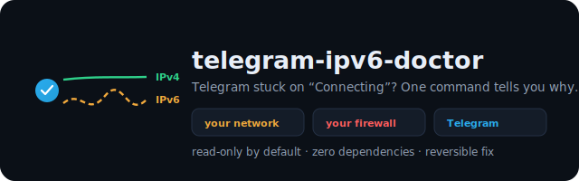
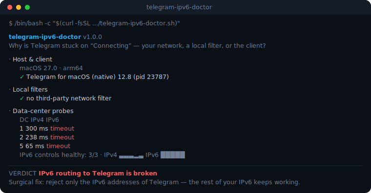

<div align="center">



# telegram-ipv6-doctor

**Telegram stuck on “Connecting” on your Mac? Find out why — in one command.**

Your network · your firewall · or Telegram itself. The tool tells you which, and fixes the one it can.

[](https://github.com/talkstream/telegram-ipv6-doctor/actions/workflows/ci.yml)
[](https://www.shellcheck.net/)
[](tests/doctor.bats)
[](#)
[-4EAA25?logo=gnubash&logoColor=white)](#)
[](#)
[](#privacy)
[](LICENSE)

**English** · [Русский](README.ru.md)

</div>

---

## The one command

```bash
/bin/bash -c "$(curl --proto '=https' --tlsv1.2 -fsSL \
  https://raw.githubusercontent.com/talkstream/telegram-ipv6-doctor/v1.0.0/telegram-ipv6-doctor.sh)"
```

It **reads, it does not touch anything.** No sudo, no changes, no telemetry. It prints a verdict.

Prefer to look before you run? That is the better habit — and the URL above is pinned, so the checksum
actually means something:

```bash
curl --proto '=https' --tlsv1.2 -fsSLO https://raw.githubusercontent.com/talkstream/telegram-ipv6-doctor/v1.0.0/telegram-ipv6-doctor.sh
shasum -a 256 telegram-ipv6-doctor.sh    # compare with the checksum in the release notes
less telegram-ipv6-doctor.sh
bash telegram-ipv6-doctor.sh
```

<div align="center"></div>

## What it actually diagnoses

“Connecting…” has more than one cause, and the wrong fix makes things worse. The tool probes every
Telegram data centre over **both** IPv4 and IPv6, probes independent IPv6 control targets, looks at the
client’s own log counters and at any local network filter, and then tells them apart:

| Verdict | What it means | What the tool does |
|---|---|---|
| **degraded IPv6 to Telegram** | IPv6 to Telegram’s data centres times out, IPv4 to the same DCs is fine, and IPv6 to the rest of the internet is healthy | offers the surgical fix ↓ |
| **IPv6 broken everywhere** | IPv6 fails to everything, not just Telegram | offers to switch IPv6 off on the interface |
| **local filter interference** | The network is clean, but a firewall/AV (Little Snitch, LuLu…) is tearing Telegram’s sockets down | **does not touch your network** — tells you to test the filter |
| **blocked / DPI** | Connections open and are reset immediately | tells you to use MTProxy; refuses to “fix” anything |
| **client-side loop** | Network is fine, the client is looping | suggests a restart / Telegram support |
| **IPv6-only network (NAT64)** | There is no IPv4 path at all | **refuses every mutation** — the fix would cut you off |
| **healthy** | No network problem visible | nothing to do |

That third row exists because it happened to us: after fixing a real IPv6 problem, the same Mac started
stalling again — and the culprit was a nightly build of a DPI firewall, not the ISP. A tool that only knows
how to blame IPv6 would have lied. See [`docs/FINDINGS.md`](docs/FINDINGS.md).

## The fix

```bash
/bin/bash -c "$(curl -fsSL .../v1.0.0/telegram-ipv6-doctor.sh)" _ fix     # note the "_" — bash eats the first argument without it
```

**Surgical by default.** It installs reject-routes for **only** those Telegram IPv6 prefixes it has just
proven broken on your machine:

```
sudo route -n add -inet6 2001:b28:f23d::/48 ::1 -reject
```

Connections to Telegram over IPv6 then fail *instantly* instead of hanging, so the client falls back to
IPv4 — and **the rest of your IPv6 keeps working** (websites, mail, everything else). Routes disappear on
reboot; `revert` removes them immediately.

The blunt alternative (`--mode ipv6-off`, disabling IPv6 on the interface) exists for the
“IPv6 is broken everywhere” case.

### It refuses to run when it shouldn’t

- no working **IPv4** path to Telegram → refused (it would cut you off completely)
- **IPv6-only / NAT64** network → refused, even with `--yes`
- the verdict is anything other than the one it was built for → refused
- a **VPN or proxy** is active → refused (the evidence cannot be trusted)
- a local **filter is tearing sockets down** → refused (fix the filter, not the network)

Every privileged command is printed before it runs. `--dry-run` prints and exits. State is saved before
any change, and `revert` restores it — verified, not assumed.

## Commands

```
diagnose   (default)   read-only diagnosis
fix                    apply the fix — only if the diagnosis proves it is warranted
revert                 undo everything, restore the saved state
status                 is a fix currently active?
report                 privacy-safe Markdown for a bug report

--mode surgical|ipv6-off   --dry-run   --yes   --json   --lang en|ru   --no-color
```

## Privacy

No telemetry, ever. The only network traffic is the probes themselves — this is enforced by a
[test](tests/doctor.bats) that fails if the script so much as invokes `curl` at runtime. `report` is built
from an allowlist: macOS version, client version, latencies, counters, verdict. No hostnames, no addresses,
no SSID, no account names, no paths.

## How it works

- **Bash 3.2**, the version stock macOS ships. Zero dependencies — `nc`, `route`, `scutil`, `perl` are all in the base system.
- Telegram’s IPv6 prefixes are a **compile-time constant**, taken from [Telegram’s published network list](https://core.telegram.org/resources/cidr.txt) and cross-checked against live BGP. They are never fetched at runtime: a hijacked remote list would mean blackholing arbitrary networks *with root*. A weekly CI job diffs the official list and opens a PR instead.
- Only prefixes **proven broken on your machine** are ever rejected. Nothing “just in case”.
- 18 offline tests (bats + fake binaries) cover every verdict, every refusal, and the privacy of the report.

Details: [`docs/SAFETY.md`](docs/SAFETY.md) · Evidence: [`docs/FINDINGS.md`](docs/FINDINGS.md) ·
For Telegram’s engineers: [`docs/UPSTREAM.md`](docs/UPSTREAM.md)

## Prior art

None that overlaps: there are mirrors of Telegram’s CIDR list and generic Happy-Eyeballs testers, but no
macOS tool that probes Telegram’s DCs on both stacks and can act on the result. If you know of one, open an issue.

## Licence

MIT © Arseniy Kamyshev · [t.me/nafigator](https://t.me/nafigator)
